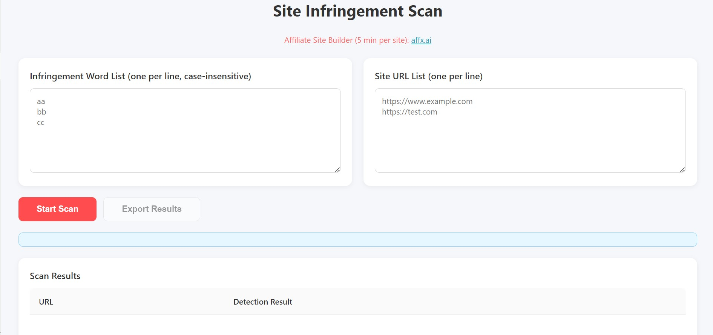

# site-infringement-scan/网站侵权词批量检测

## Features/功能

Site Infringement Scan is a lightweight tool that quickly checks whether all pages of a website contain specified infringement words.  
Site Infringement Scan 是一个轻量级工具，能够快速检测网站所有网页中是否包含指定的侵权词。

It supports checking both page text content and image `alt` text, helping users identify potential infringement risks more efficiently.  
它支持同时检测网页正文内容和图片的 `alt` 文本，帮助用户更高效地识别潜在侵权风险。

## Usage/使用方法

Use it via the browser extension: [Site Infringement Scan](https://chromewebstore.google.com/detail/site-infringement-scan/nlfhikomacdjingjdinpafkoekfphfol)  
通过浏览器插件的方式使用：[网站侵权词批量检测](https://chromewebstore.google.com/detail/site-infringement-scan/nlfhikomacdjingjdinpafkoekfphfol)

1. Enter the domain name of the website you want to scan.  
1. 输入想检测的网站域名。

2. Enter the list of infringement words you want to detect.  
2. 输入需要检测的侵权词列表。

3. The extension will automatically crawl the pages under the domain and check whether each page contains the specified infringement words, including image `alt` text.  
3. 插件会自动检测该域名下的各个网页中是否包含指定侵权词，包括图片 `alt` 文本也会同时检测。

## Requirements/要求

The target website must provide `sitemap.xml`, `sitemap_index.xml`, or a similar sitemap file. WordPress-generated sitemaps are supported.  
目标网站必须提供 `sitemap.xml`、`sitemap_index.xml` 或类似的 sitemap 文件，支持 WordPress 自动生成的 sitemap。

